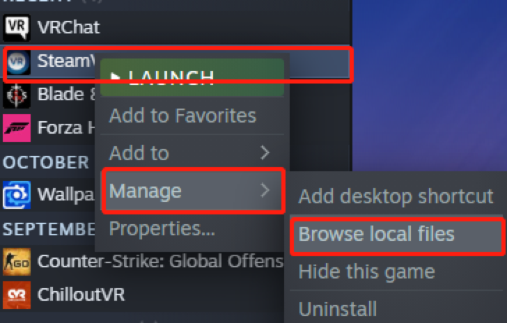

# **OpenVR Driver**
---

This doc will guide you through setting up Open-VR Driver required for communication between VR headsets and Surplex's shoes. Our driver is [open-sourced] on Github.

{: .note }
Our OpenVR Driver is developed based on previously open-sourced OpenVR [driver] developed by John Dean. It used WebSocket to communicate between trackers and SteamVR. As a pre-requisite, you would need to install [OpenSSL] on your computer if you haven't done so before.

You can install the driver by: Download the [driver file] and moving the `websocket_trackers` directory into the SteamVR driver's directory, which should be located somewhere at: 
````
C:\Program Files (x86)\Steam\steamapps\common\SteamVR\drivers
````

   <!--  -->


Once you have done the steps above, please head over to Surplex [software] page for the final steps required before using Surplex's shoes!


---

FAQ:
1. what is OpenSSL?

    OpenSSL is an open-source command line tool that is commonly used to generate private keys, create CSRs, install your SSL/TLS certificate, and identify certificate information. It's used here to ensure secure data transmission. Detail can be found here: [https://www.openssl.org/]

2. Can I build my own version of Driver?

    Yes! Please feel free to make edits to the driver file to make it works better for you. You will need to install [CMake] in order to build the driver. 

[Cmake]: https://cmake.org/
[https://www.openssl.org/]: https://www.openssl.org/
[driver]: https://github.com/John-Dean/OpenVR-Tracker-Websocket-Driver
[OpenSSL]: https://slproweb.com/products/Win32OpenSSL.html 
[driver file]: https://github.com/surplex-io/OpenVR-Driver/releases/download/1.0.2/websocket_trackers.zip
[software]: ../software.html
[open-sourced]: https://github.com/surplex-io/OpenVR-Driver/