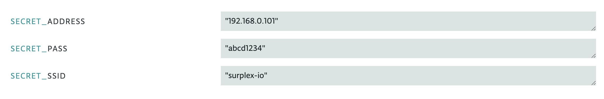
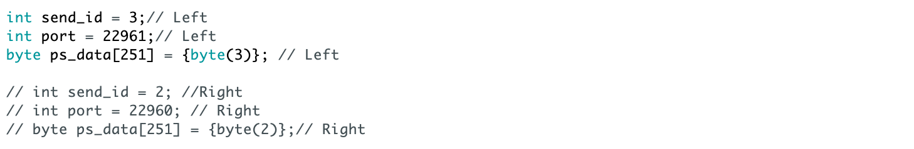
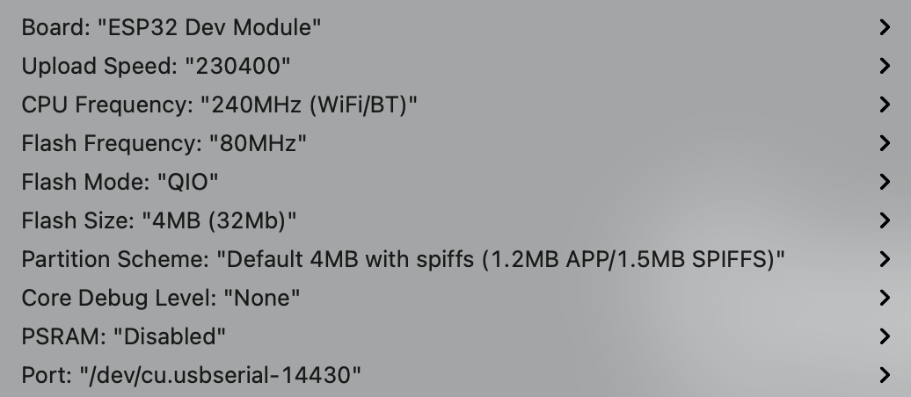
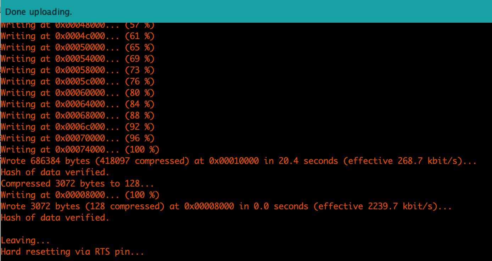
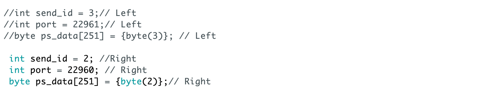

# **Surplex Firmware**
---

This doc will guide you through downloading and uploading firmware to your Surplex's Shoes.

{: .note }
Our firmware is developed on the platform of Arduino. We used Wi-Fi for data transmission. Hence, it's required for our shoes to connect to your home Wi-Fi. You will need to change the metadata (e.g., Wi-Fi password) in our firmware before uploading into our shoes. Don't hesitate to get in touch with support if you find it hard to follow through with the steps.

Please go through the following steps:

1. Download Firmware Zip through our firmware [repository].

2. Go to Arduino IDE (If you have installed) or Arduino [Cloud Editor] and open the firmware file.

3. Change the SECRET metadata to your own Wi-Fi information, for example:

   

4. Upload firmware to the left shoe with default metadata as follow:
   
   

   Choose **ESP32 Dev Module** for board and **230400** for Upload Speed without making changes to other options. Connect the left shoes to your computer, select the correct port, and click upload!

   You will have setup similar to this: (Port numbers will varies based on your system)

   

   You will see logs like this if it is successful: (Please contact us if it didn't work out for you)

   
   

5. In the main `.ino` file, comment out left metadata and uncomment right metadata as follow. Then upload firmware to the right shoes with the same steps as above.

   

Once you have uploaded the firmware, please head over to Surplex's [Driver] site and download Surplex's OpenVR driver for communicating between Surplex's shoes and VR headsets.

---

FAQ:
1. Can I make edit to the firmware?

   It's suggested to create pull requests on Github rather than directly making changes to it, which might lead to malfunctioning devices.

[repository]: https://github.com/surplex-io/surplex_firmware/
[Cloud Editor]: https://create.arduino.cc/editor/
[Driver]: ../driver.html