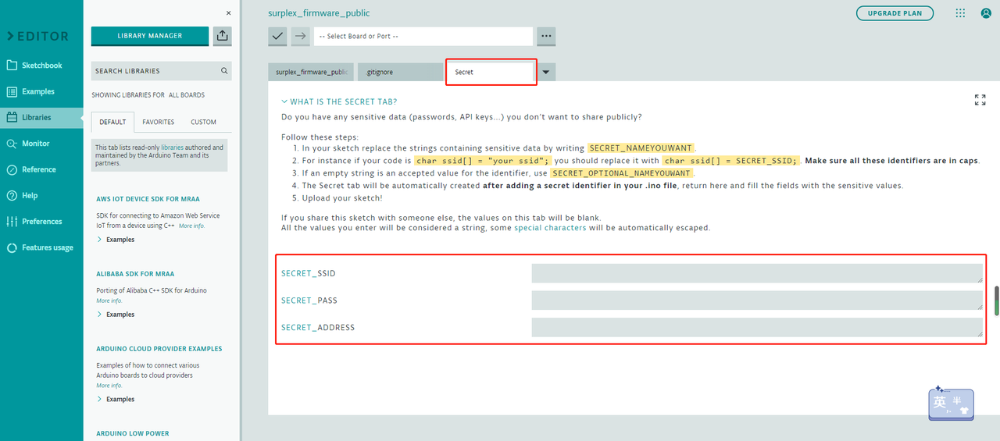
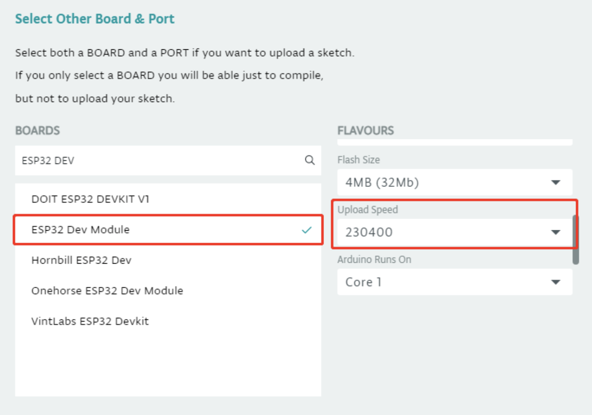
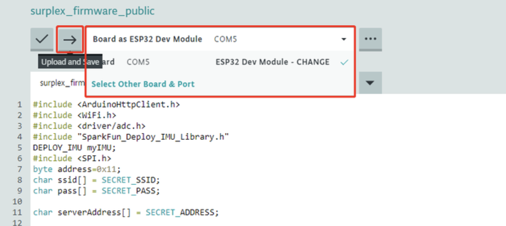
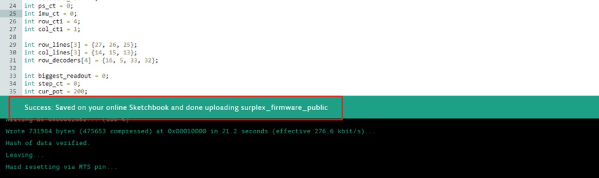

# **Surplex Firmware**
---

This doc will guide you through downloading and uploading firmware to your Surplex's Shoes.

{: .note }
Our firmware is developed on the platform of Arduino. We used Wi-Fi for data transmission. Hence, it's required for our shoes to connect to your home Wi-Fi. You will need to change the metadata (e.g., Wi-Fi password) in our firmware before uploading into our shoes. You might these tutorials helpful either when you are uploading with [Arduino Cloud Editor] or [Arduino IDE]. Don't hesitate to get in touch with [support] if you find it hard to follow through with the steps.

Please go through the following steps:

1. Download Firmware Zip through our firmware [repository].

2. Go to Arduino [Cloud Editor] and open the firmware file. (It works similar for Arduino IDE)

3. First, download [Arduino Cloud addon] for code upload. 

4. Then, go to `surplex_firmware_left.ino` file, change the **SECRET** metadata to your own Wi-Fi information (Check Menu "Wi-Fi Connection" if you do not know where to find this information). Please remember to add double quotes before and after your information, for example:

   
   

5. Upload firmware to the left shoe:
   
   <!--  -->

   Choose **ESP32 Dev Module** for board and **230400** for Upload Speed without making changes to other options. Connect the left shoes to your computer (make sure the switch is on), select the correct port, and click upload!  
     
   

   You will see logs like this if it is successful: (Please contact us if it didn't work out for you)

   
   

6. Go to `surplex_firmware_right.ino` file, upload the firmware to the right shoes with the same steps as above (from 4 - 5).

   <!--  -->

Once you have uploaded the firmware, please head over to Surplex's [software] page for the final steps required before using Surplex's shoes!

---

FAQ:
1. Can I make edit to the firmware?

   It's suggested to create pull requests on Github rather than directly making changes to it, which might lead to malfunctioning devices.

[Arduino cloud addon]: https://create.arduino.cc/getting-started/plugin/welcome
[Arduino IDE]: https://randomnerdtutorials.com/installing-the-esp32-board-in-arduino-ide-windows-instructions/
[Arduino Cloud Editor]: https://docs.arduino.cc/arduino-cloud/getting-started/getting-started-web-editor
[repository]: https://github.com/surplex-io/surplex_firmware/
[Cloud Editor]: https://create.arduino.cc/editor/
[software]: ../software.html
[support]: ../support.html